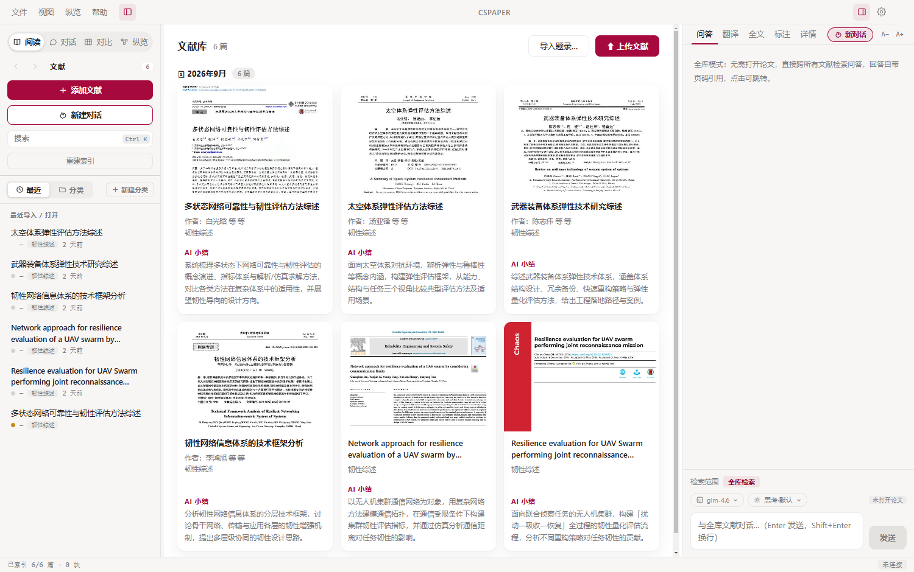
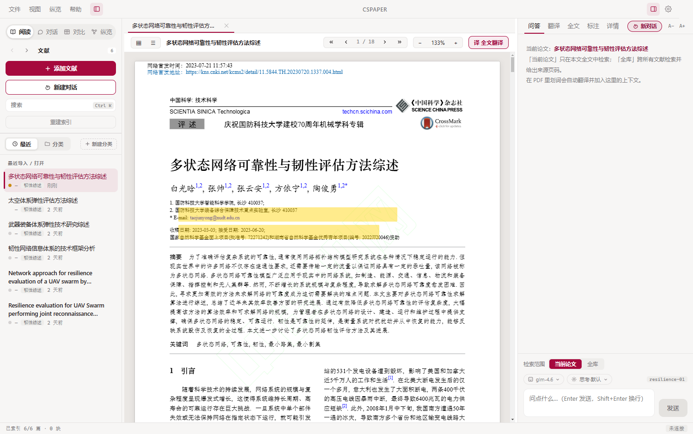
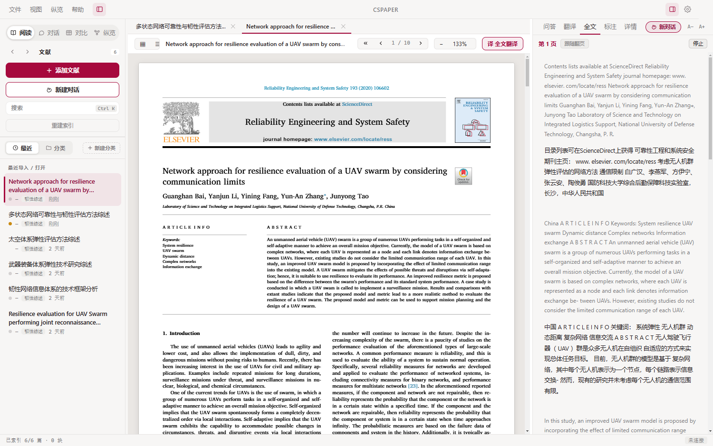
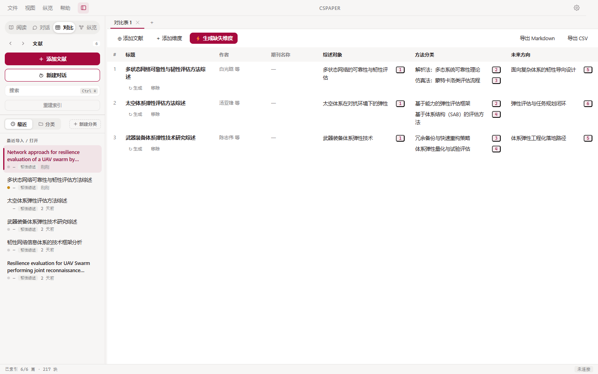
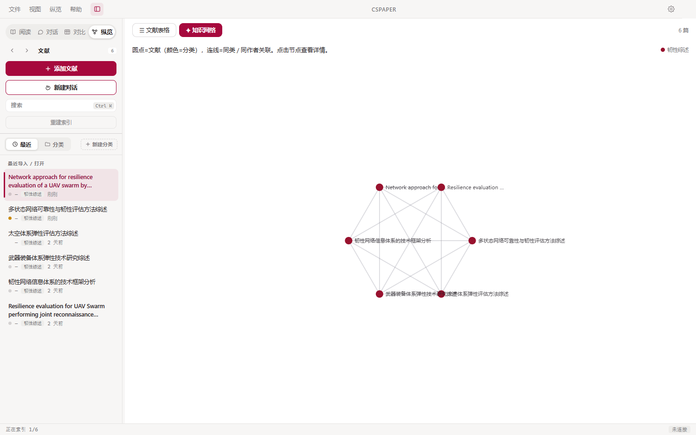
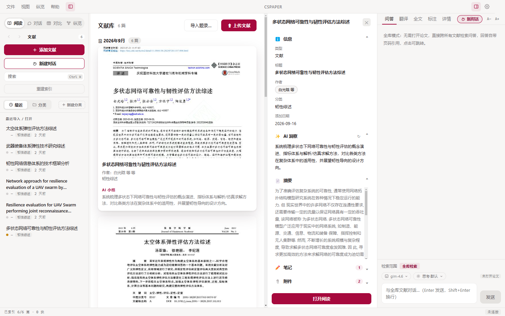
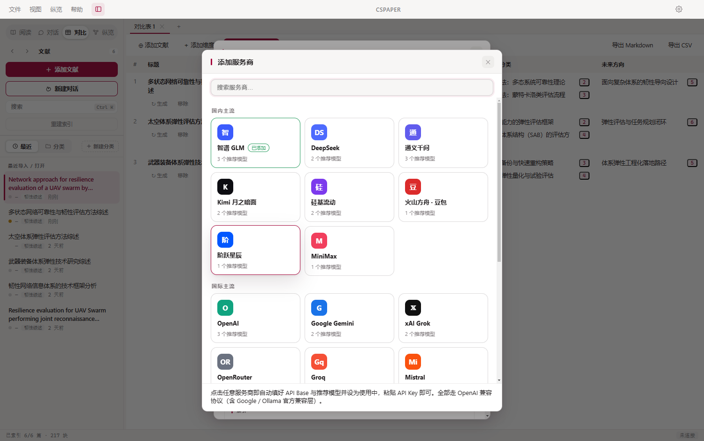

# 📚 CSPAPER

### 更适合中国人的 AI 文献管理工作台

**划词翻译 · 论文问答 · 全库对话 · AI 对比表格 · 知识网络 —— 数据全部留在本机**

**🌐 [在线体验](https://jensen-yao.github.io/CSPAPER/demo.html)** ·
**⬇️ [下载安装包](https://github.com/Jensen-Yao/CSPAPER/releases)** ·
**🗺 [路线图](./ROADMAP.md)**

---

## 为什么做 CSPAPER

Zotero 很强，但对中文科研人不够顺手：划词翻译要装插件、全文翻译要付费、对比阅读没有、AI 问答要绕远路。
**CSPAPER 把这些一步到位**：开源、本地优先、任意大模型 Key（甚至免 Key）即可上手。

## ✨ 它能做什么

| | 功能 | 说明 |
|---|---|---|
| 🖼 | **文献卡片墙** | 按月分组的封面卡片视图，PDF 首页缩略图 + 一键 AI 小结；点卡片看详情（信息 / AI 洞察 / 摘要 / 笔记 / 附件） |
| 📖 | **沉浸阅读** | 缩略图 / 目录双导航、多标签阅读、触控板缩放、划词高亮持久化、**Ctrl+F 页内查找**、**续读记忆**（重开跳回上次页码） |
| 🌐 | **划词翻译** | 选中即译，配置大模型后带术语消歧与术语对照；**不配 Key 走免费通道也能译** |
| 📄 | **全文翻译** | 当前页逐段中英对照，支持「跟随翻页」自动连译 |
| 💬 | **论文问答 / 全库对话** | 整篇或跨库 RAG，回答带页码引用角标，点击跳回原文高亮验证 |
| 📊 | **AI 对比表格** | 多篇文献按维度横向对比：基础字段直接提取，分析维度 AI 提取要点（附页码出处），可自定义维度，导出 Markdown / CSV |
| 🔍 | **纵览** | Zotero 式文献总表（标签 / 五态状态 / 进度条 / 被引列，批量更新被引）+ **知识网络**图谱 + **统计仪表盘**（阅读时长 Top / 月度时间线 / 分类分布 / 标题词云） |
| 🏷 | **标签系统** | 彩色标签 + 计数 + 一键筛选；阅读状态五态（稍后读/待读/在读/已读/暂不读），**Alt+1~5** 快捷切换 |
| 📝 | **笔记中心** | 全库「我的笔记」+ 划词标注聚合视图，内置文献阅读卡等笔记模板，自动保存，一键导出 Markdown / **思维导图 HTML** |
| 🔬 | **参考文献抓取** | 自动解析当前论文的参考文献列表，单条查看 AI 摘要（DOI 优先）、一键入库并记录「引自」来源 |
| 🌍 | **Translators 抓取脚本** | 对标 Zotero Translators：内置 arXiv / DOI / IEEE / ScienceDirect / Springer·Nature / Wiley / PubMed / 知网 / 万方 / 百度学术等 13 个站点脚本，**社区脚本放进数据目录即生效**（[脚本贡献指南](./docs/translators.md)）；「在线添加」支持 DOI / arXiv ID / 链接 / 关键词多源检索，自动抓合法 OA PDF |
| 📑 | **CSL 万种引文样式** | 内置 12 种常用样式（GB/T 7714 两种 / APA / MLA / Chicago / IEEE / Vancouver / Nature / Science / Cell / Harvard / Elsevier）；设置里可从官方 CSL 样式库（10000+）按需下载、导入 .csl；引文助手网页与 Word 加载项全链路可用 |
| 📈 | **影响因子 / 被引** | OpenAlex 免 Key 更新被引次数列；期刊 IF / 分区支持 CSV 导入显示 |
| 🧩 | **浏览器插件** | arXiv / 期刊页 / PDF 链接右键一键保存，PDF 自动下载入库；**优先走 Translators 脚本抓取**，题录更准 |
| 📱 | **Android 端** | 桌面端导出 `.cspack` 数据包，手机离线阅读；批注可合并回电脑 |
| 📝 | **Word / WPS 引文** | 检索文献库插入 `[n]` 引用，样式下拉自由切换（同 CSL 样式目录），一键生成参考文献（支持 BibTeX） |
| 🇨🇳 | **中文生态** | Zotero 库一键迁移（含标签/摘要/子笔记）、CNKI 题录导入、中文标题与分类全流程支持、深色模式、关闭最小化到托盘、导入重命名模板 |

## 🆚 Zotero 插件生态对标

社区文章盘点的 20 个 Zotero 常用插件能力，CSPAPER v0.6 逐项内建（开箱即用，无需装插件）：

| Zotero 插件 | 作用 | CSPAPER 对应 |
|---|---|---|
| Zotero Style / Tag / actions-tags | 彩色标签分栏、自定义列 | 内建标签系统（彩色标签+筛选）+ 表格标签/进度/被引列 |
| Reading List | 阅读状态管理 + 快捷键 | 五态阅读状态 + **Alt+1~5** 快捷键 |
| Chartero | 阅读统计可视化 | 统计仪表盘（时长 Top / 时间线 / 分类环图 / 词云） |
| Zotcard + Better Notes | 卡片笔记模板 / 笔记增强·思维导图 | 笔记中心 + 4 种笔记模板 + 我的笔记自动保存 + 思维导图 HTML 导出 |
| zotero-reference | 自动抓参考文献、一键入库 | 阅读侧栏「文献」tab：抓取 → AI 摘要 → 一键入库（记录「引自」） |
| 茉莉花 Jasminum | 知网元数据 / 中文文献 | CNKI 题录导入 + 知网/万方/百度学术抓取脚本（尽力而为）+ 中文全流程 |
| zotero IF / 小绿蛙 | 影响因子与分区 | OpenAlex 免 Key 被引列 + 期刊 IF/分区 CSV 导入 |
| Scite Plugin | 被引佐证次数 | 「更新被引」批量拉取 OpenAlex cited_by_count |
| Sci-Hub Plugin | DOI 下载 PDF | 合法替代：在线添加自动抓 OA PDF（arXiv / Crossref / OpenAlex OA 链接） |
| Scholaread | 全平台对照翻译 | 全文逐段中英对照 + Android `.cspack` 离线阅读 |
| Zotero Connector | 浏览器一键抓取 | 内建浏览器插件，且**优先走 Translators 脚本**抓得更准 |
| PDF Preview | 条目预览 | 卡片墙封面 + 详情面板 + 表格展开附件 |
| Night for Zotero | 深色模式 | 内建浅色 / 深色 / 跟随系统 |
| Keep Zotero | 后台常驻 | 「关闭时最小化到托盘」设置 + 托盘常驻 |
| ZotFile | 附件重命名规则 | 导入重命名模板 `{author}_{year}_{title}` |
| Del Item with Attachment | 精细删除 | 删除三选：移入废纸篓 / 仅移出库保留文件 / 取消 |
| CSL 引文样式（万种） | 排版引用 | 内置 12 种样式 + 官方 CSL 库 10000+ 按需下载 + .csl 导入 |
| Zotero Translators（架构） | 抓取脚本可扩展 | 同构架构：声明式脚本目录，社区脚本热加载（[贡献指南](./docs/translators.md)） |
| Notero | Notion 同步 | 规划中（见 ROADMAP） |

## 🖼 界面速览

| 阅读 + 划词 | 全文翻译·逐段对照 |
|---|---|
|  |  |

| AI 对比表格（要点附页码出处） | 知识网络 |
|---|---|
|  |  |

| 卡片详情栏 | 服务商一键配置 |
|---|---|
|  |  |

## 🚀 快速开始

1. **下载安装**（见下方）并启动，跟着三步向导走完
2. **选文献库文件夹**（已有 Zotero？向导里点「从 Zotero 一键迁移」）
3. **配一个模型**：设置 → 「从服务商库添加」→ 智谱 / DeepSeek / 通义 / Kimi / OpenAI / Ollama… 粘贴 Key 即用（跳过也能用阅读和翻译）
4. **导入文献**：拖入 PDF / 文件夹，AI 自动识别标题并归类；有 Key 时自动生成 AI 小结
5. 开始阅读：划词翻译、追问、全文对照、对比表格、知识网络……

## 📦 下载

| 平台 | 文件 |
|---|---|
| Windows 10/11 x64 | `CSPAPER Setup <版本>.exe` |
| macOS（Apple Silicon / Intel） | `CSPAPER-<版本>-arm64.dmg` / `-x64.dmg` |
| Android 7.0+ | `CSPAPER-Mobile-*.apk` |

> 未做代码签名：Windows 首次运行 SmartScreen 选「仍要运行」；macOS 首次打开右键 App →「打开」，或 `xattr -cr /Applications/CSPAPER.app`。
>
> 配套工具：[`extension/`](./extension) 浏览器插件（开发者模式加载）· [`word-addon/`](./word-addon) Word 加载项 · [`android-app/`](./android-app) Android 工程。

## 🧰 技术栈

| 层 | 技术 |
|---|---|
| 桌面 | Electron + electron-vite + React 18 + TypeScript（无 UI 库，手写设计系统） |
| PDF | pdf.js（CJK cmap 完整支持，缩略图 / 目录 / 文本层） |
| 存储 | better-sqlite3（FTS5 trigram 全文检索，单文件本地库） |
| 检索 | 段落级向量 + BM25 混合；文献级标题/首页向量补全 |
| 嵌入 | transformers.js 本地 e5-small / 智谱 / Ollama |
| 大模型 | 任意 OpenAI 兼容接口，多服务商配置档案，一键预设 18+ 家 |
| 生态 | 本地桥接服务（127.0.0.1:24517）连接浏览器插件 / Word 加载项 / 引文助手 |

## 🔐 隐私与数据

- 文献库、索引、高亮、对话记录**全部保存在本地**（SQLite + 文件），不上传任何服务器
- 嵌入模型默认本机推理；配合 Ollama 可完全离线
- 插件生态走本地通信（`127.0.0.1:24517`），数据不出本机

## 🗺 路线图

详见 [ROADMAP.md](./ROADMAP.md)：CNKI 深度适配、iOS 端与云同步（WebDAV）、开放插件系统等。

**如果 CSPAPER 对你的科研有用，欢迎点一个 ⭐ Star**

